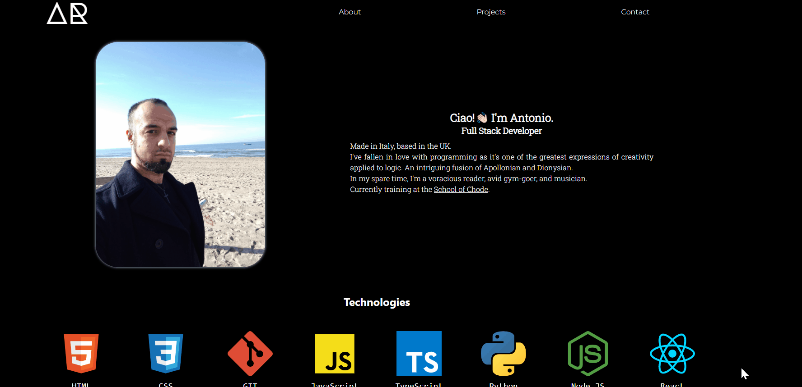

# Portfolio page

## Description

A portfolio page to build my online presence and showcase some of my projects.  
On this occasion, I've chosen to go with a very simple style and layout and forego any styling frameworks in favour of plain CSS. 

## Technologies

- React
- CSS modules

## Links

- [antonioriccelli.com](https://antonioriccelli.com/)
- [antonio.riccelli.netlify.app](https://antonio-riccelli.netlify.app/)

## License

[MIT](https://spdx.org/licenses/MIT.html)

